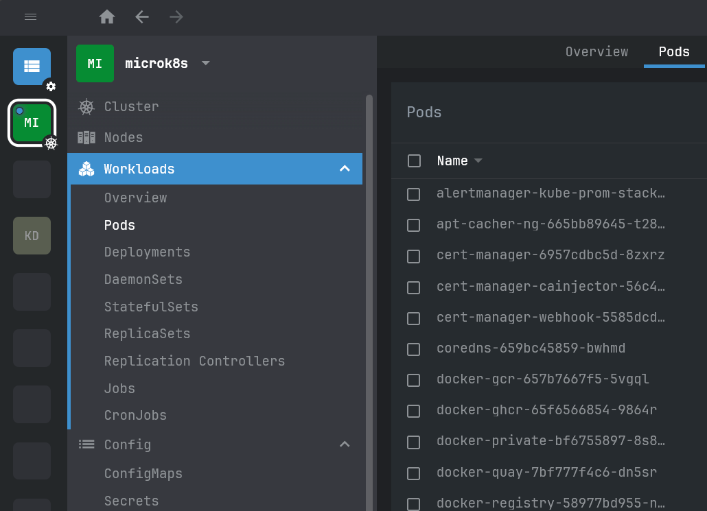

# openlens-mono-font

OpenLens extension to change font to monospace, specifically: `'JetBrainsMono Nerd Font', 'Cascadia Code', Consolas, monospace`.



# Installing this extension

In OpenLens, navigate to the Extensions list. In the text box, enter the name of this extension:

```
openlens-mono-font
```

Click "Install", and after a few moments, the plugin should appear in the list of installed extensions and be enabled.

You may need to restart OpenLens if you don't see changed fonts.
